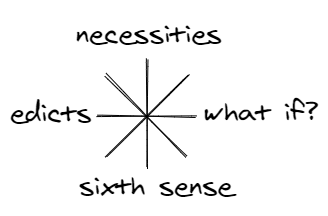

# MODA: from here to there in an agile world

Sketched maps are an easy way to direct ourself and/or others along a, what seems to be the best, path to a certain point. From the moment that we start with sketching the first map and reaching that point we need to take decisions and we learn as we progress. When we sketch maps, we strip away all uneccesary details. Sometimes we also map the dragons to indicate possible dangers (“We don’t know what’s here!” and the dangers of ignorance) like the old mapmakers did. And only map with few well chosen features will give a much better map than a map cluttered with many insignificant features, only simplicity provides a lasting impression.

## The Skeleton
This skeleton becomes visible when you show only the connected features and lines. No matter how many different types of information you want to overlay on the skeleton, the skeleton will always be there for reference. 
These are the steps for making a map skeleton:
    

Such a skeleton can become very messy (like a bowl of spaghetti), but luckily we can keep it readable by looking what Harry Beck did. <a href="https://en.wikipedia.org/wiki/Harry_Beck">Harry Beck</a> designed one of the most famous maps, the iconic map of London’s Underground subway system.
      

      
Harry Beck's map provides a coherent overview of a complex world, the world of the London Underground. With only horizontal, vertical, and 45 degree lines, the map became a beautiful organizing image of London. He made the map by following a few simple principles:

      

Another way to keep maps simple is to use a small set of visual elements which everybody can understand. I use these:

    

I always use a compass to check my maps. But we can't use a real compass when we make a map of abstact things like concepts and ideas.So I made this compass that can be used to check if the map is complete:

  

---

## The OODA Loop

[Boyd](https://www.airuniversity.af.edu/Portals/10/AUPress/Books/B_0151_Boyd_Discourse_Winning_Losing.PDF) referred to the OODA loop as “the big squeeze,” the ultimate compression of his ideas, the composite of how we think and learn.

The letters OODA stand for:
- **O**bserve: This is the part in which you use your eyes and ears to observe, to scan the environment 
- **O**rient: Then you try to understand (evaluate) your situation in relation to what you scanned. And what routes you can take to reach your (next) control point. 
- **D**ecide: Based on your orientation you choose what you think is the best possible next step that you wlll take 
- **A**ct: And then you take that next step…

### The original OODA Loop diagram

## the MODA map

I decided to make my own version of the OODA loop to better understand the decision-making and learning processes when using maps as primary source for the communication within change projects. I must note that I work (for twenty years now) as an IT/infrastruction/Solution Architect. For the people who know the Cynefin framework, for my work I live almost only in the Obvious and Complicated areas.

My version of the OODA loop has become the MODA map:

I've changed the following things in my MODA map compared to the original OODA loop:

* I've replaced Observe with Map. To be able to map you must be a good observer and sketcher. 
* I made it look like a subway diagram by removing the feedback and implicit guidance arrows. Like in the London Underground you can start where you want and go from every point to every other point. And you can skip intermediate points if you want.
* I've added a feature called Patterns. This is a kind of library which can be internal in the heads of people or external, e.g. a folder where sketched maps are stored. This concept is borrowed from the OODA loop example in Tom Graves his Change-mapping book.

The MODE has 5 line which will be described in the following paragraphs.

#### Directing

Directing is the black main line:

#### Mapping

Mapping is the red line:

#### Learning

Learning is the green line:

#### Changing

Changing is the blue line:

#### Surprising

Surprising is the orange line:

---

## Contact
You can contact me on [Twitter](https://twitter.com/mapbakery)
