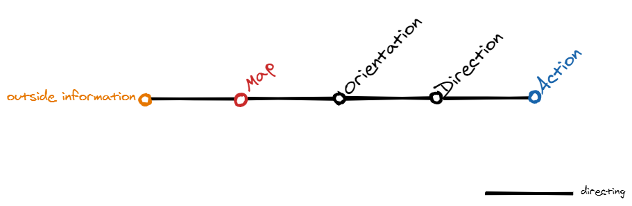
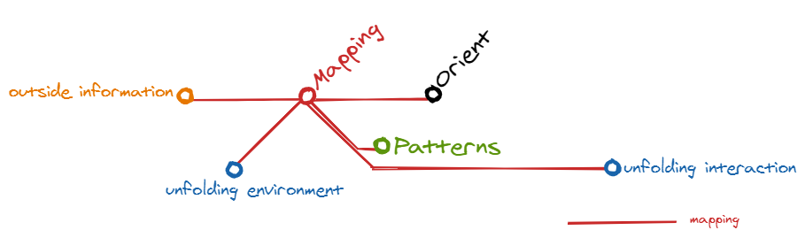
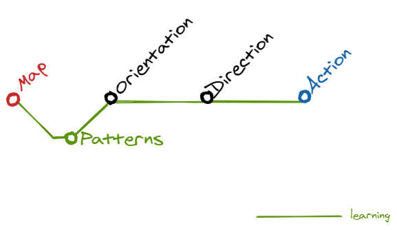
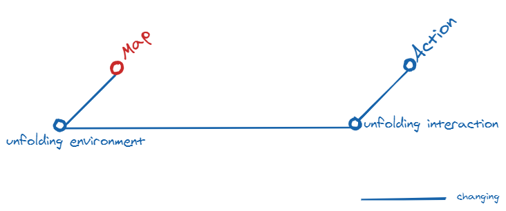
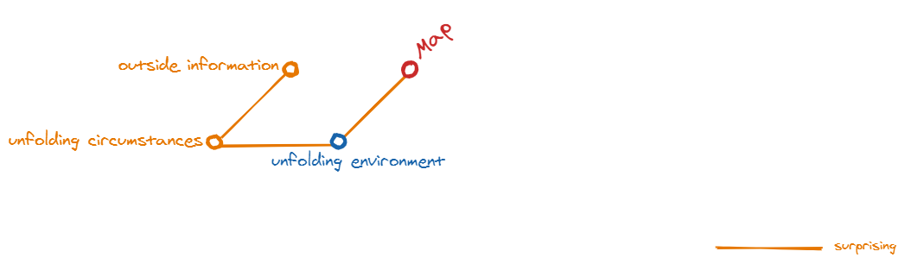

[Boyd](https://www.airuniversity.af.edu/Portals/10/AUPress/Books/B_0151_Boyd_Discourse_Winning_Losing.PDF) referred to the OODA loop as “the big squeeze,” the ultimate compression of his ideas, the composite of how we think and learn.

The letters OODA stand for:
- **O**bserve: This is the part in which you use your eyes and ears to observe, to scan the environment 
- **O**rient: Then you try to understand (evaluate) your situation in relation to what you scanned. And what routes you can take to reach your (next) control point. 
- **D**ecide: Based on your orientation you choose what you think is the best possible next step that you wlll take 
- **A**ct: And then you take that next step…

### The original OODA Loop diagram

This original loop is not very easy to transfer to a business environment, but below are some sketches with ideas how this can be done. The ideas are based on dialogs and input from [Ruth Malan](https://twitter.com/ruthmalan), [Tom Graves](https://twitter.com/tetradian) and [Oliver Baier](https://twitter.com/OliverBaier).

--- 

# OODA(R)

This is a proposal for an OODA loop including an additional review phase and a library where precedents can be stored:

.png)

---

# MODA: from here to there in an agile world

## The MODA map

I decided to make my own version of the OODA loop to better understand the decision-making and learning processes when using maps as primary source for the communication within change projects. I must note that I work (for twenty years now) as an IT/infrastruction/Solution Architect. For the people who know the Cynefin framework, for my work I live almost only in the Obvious and Complicated areas.

My version of the OODA loop has become the MODA map:

I've changed the following things in my MODA map compared to the original OODA loop:

* I've replaced Observe with Map. To be able to map you must be a good observer and sketcher. 
* I made it look like a subway diagram by removing the feedback and implicit guidance arrows. Like in the London Underground you can start where you want and go from every point to every other point. And you can skip intermediate points if you want. So it's not longer a loop but a undirected graph.
* I've added a feature called Patterns. This is a kind of library which can be internal in the heads of people or external, e.g. a folder where sketched maps are stored. This concept is borrowed from the OODA loop example in <a href="http://weblog.tetradian.com/2020/02/09/on-change-mapping-books-and-more/">Tom Graves his Change-mapping book</a>.

The MODE map has 5 different colored lines which will be described in the following paragraphs. For the descriptions I will use this very common starting question I often get:

> I need to get files to THERE, can you help?

#### Directing

Directing is the black main line:

So most of the time the first outside information is a question from somebody looking for help to get someting done, in this case sending files to THERE. To answer the question I need more information. Especially who or what will provide the files which must be send to THERE. If that question is answered I have my HERE. Sometimes this info is enough to recognize that we have a standard pattern for this. So I draw a simple map with the HERE and THERE and information via which procedures the file transfer can be implemented. The person who asked the question can use this to get the file transfer implemented. My involvement stops here.

Most people who come with the same question expect that it always will be so obvious, but unfortunately that is not the case. That will become clear from the descriptions of the other lines.

#### Mapping

Mapping is the red line:

Often I don't immediately recognize the HERE or the THERE and then I must first explore what the locations are of the HERE and THERE. If I'm lucky the person who asks the question knows the answer. Let's assume that's the case then I still need more outside information before I can make a map because we can have a lot of different situations e.g.:

1. The HERE and THERE both exists but THERE is an external application.
2. The HERE exists but will be moved to another platform soon (exact date when it goes into production on the new platform is still unknown)
3. The HERE exists but the THERE is under design.

For situation 1 I must look at the patterns, for situation 2 I must know more about the unfolding interactions and unfolding environment. For example I would like know if the new target platform already built or still just under design. Probably I need to make an intermediate map and an end-state map with different directions. If the target plaform already is being built I must know more about the unfolding environment. What is the planning, can we already prepare things or maybe already do technical tests? And is the new platform still supporting our standard file transfer standards?
For situation 3 I need to know more about the unfolding interactions. How far is the design, will it support standard file transfer patterns? Can we influence their design (and their map, decisions, action and unfolding interactions)?

#### Learning

Learning is the green line:

In the situatuations 2 and 3 I mentiond in the above Mapping paragraph it might be possible that we can't use existing file transfer patterns. in that case we must follow the green line to get a new pattern approved. And perhaps actions are needed to change the environment to support the new pattern. Another possibility is that there are patterns I'm not aware of and who are new for me. In that case I must perhaps talk to people responsible for such a pattern to help me decide what needst to be done before we can take action to use the pattern for our purposes. For the communication I will use the map I have and I will adapt the map to the pattern if I know more about it.

#### Changing

Changing is the blue line:

When the map, the location(s) and the directions are known it's time to set the change into action. Most technical specialists will be temporarily involved for just a few tasks. They can use the map and directions to understand the context for their tasks. Sometimes things (the unfolding interactions and/or unfolding environment) don't work as anticipated or take things take to long. in that case we must go back to the map and see if we have other locations/directions we can use.

#### Surprising

Surprising is the orange line:

Surprising can be all things which happen outside our control and we couldn't or didn't anticipate. Sometimes patterns are suddenly not supported any longer or sometimes there is a life-cycle management project which impact our unfolding environment (and perhaps our map). 

---

## Contact
You can contact me on [Twitter](https://twitter.com/mapbakery)
