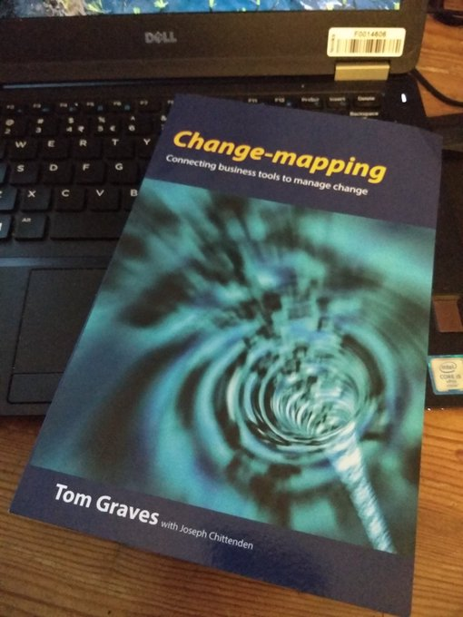

# Sketching Maps: from here to there in an agile world
Sketched maps are an easy way to direct ourself and/or others along a, what seems to be the best, path to a certain point. From the moment that we start with sketching the first map and reaching that point we need to take decisions and we learn as we progress. When we sketch maps, we strip away all uneccesary details. Sometimes we also map the dragons to indicate possible dangers (“We don’t know what’s here!” and the dangers of ignorance) like the old mapmakers did.

A map with few well chosen features will give a much better map than a map cluttered with many insignificant features, only simplicity provides a lasting impression.

## The Skeleton
This skeleton becomes visible when you show only the connected features and lines. No matter how many different types of information you want to overlay on the skeleton, the skeleton will always be there for reference. 
These are the steps for making a map skeleton:
    

Such a skeleton can become very messy (like a bowl of spaghetti), but luckily we can keep it readable by looking what Harry Beck did. <a href="https://en.wikipedia.org/wiki/Harry_Beck">Harry Beck</a> designed one of the most famous maps, the iconic map of London’s Underground subway system.
      

      
Harry Beck's map provides a coherent overview of a complex world, the world of the London Underground. With only horizontal, vertical, and 45 degree lines, the map became a beautiful organizing image of London. He made the map by following a few simple principles:

      

Another way to keep maps simple is to use a small set of visual elements which everybody can understand. I use these:

    

I always use a compass to check my maps. But we can't use a real compass when we make a map of abstact things like concepts and ideas.So I made this compass that can be used to check if the map is complete:

  

## Examples

### The OODA Loop

- Observe: This is the part in which you use your eyes and ears to observe, to scan the environment 
- Orient: Then you try to understand (evaluate) your situation in relation to what you scanned. And what routes you can take to reach your (next) control point. 
- Decide: Based on your orientation you choose what you think is the best possible next step that you wlll take 
- Act: And then you take that next step…

#### The original OODA Loop diagram

#### The sketched OODA Loop
In my sketch I don't include all implicit guidance and feedback arrows from the full OODA diagram. And I don't include the Observe/Orient/Decide/Act texts. So less arrows without compromising [the intention of the OODA loop](https://www.artofmanliness.com/articles/ooda-loop/):

 

## Change-mapping tiny-review

The [Change-mapping book by Tom Graves book](http://weblog.tetradian.com/2020/02/09/on-change-mapping-books-and-more/) is very "Unflattening", more meets the eye than is presented on the page.

** Note: Unflattening is a reference to the [Unflattening](https://hup.harvard.edu/catalog.php?isbn=9780674744431) book **
