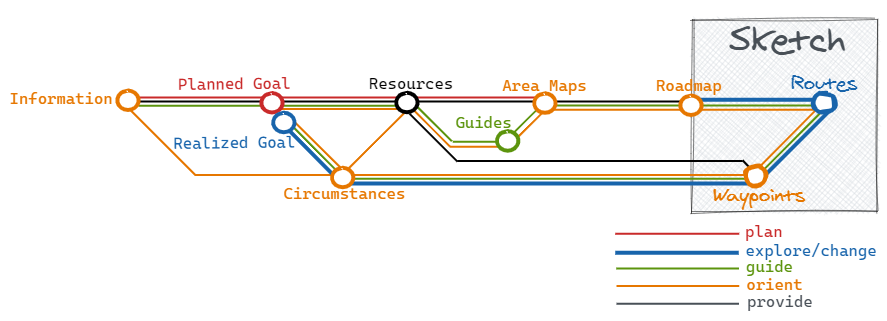

# Whenever somebody asks me for directions, I sketch a simple map...

---

## Mental mapping

Cognitive science and research work in other related areas has shown we develop ‘place cells’ in the brain corresponding to points in the physical or conceptual environment and gradually build them up into a mental map of points, paths and, eventually, areas. 
The mental map we build revolves around the relationship between memorable locations and routes insofar as they are relevant to our needs. 

The way our brains mentally map areas means that when we encounter a new area, we start with specific arrival and destination points. 
From there, we find out paths between these points. We build up knowledge of the area surrounding the points and paths and, gradually, areas of areas (”areas all the way down”). Step by step, we build up our knowledge and increase our mental maps until we have as much information as we need.

The stronger a mental map we have, the more confident we are about planning a way to and reaching our destination or exploring new areas of interest. A good wayfinding (mapping) system should support this natural process of mental mapping.

## The universal mapping language

Maps are an efficient, straightforward way of communicating a wealth of information. They provide a rich experience, quickly answering questions relevant to the map user, for example:

- Where am I now?
- Which direction do I need to go?
- How difficult will it be to get there?

Just as our brain uses just three basic elements to map the structure of the world, so can the same three elements be used to make maps on paper or digital maps which can be shared with others. Below I give some examples how maps can look like when you use only points, paths and (nested) areas.

The arrow can be used to map actions. So these are all elements you'll need to know:

[Mapping elements](images/DiagrammingTheWorldSketchElements.png)

The advantages of using just those universal mapping elements is that:

- maps are easy to read
- maps are easy to explain
- it's easy to collaborate when making maps
- people are more willing to give feedback
- it's easy to integrate a map and a story
- **and most important it supports and enforces our natural mental mapping process!**

## Living maps

For map users it is important that the maps follow the principle of ‘progressive disclosure’ – just enough information and
not too much. So it is important that maps can be sketched quickly on the fly, e.g. on paper or on a (digital) whiteboard, for a dedicated purpose. Form follows function, so the looks are less important than the content and the consisten use of the three mapping elements (oints, paths and areas). And when a journey based on a sketched map has started, the map must be updated if needed, e.g. when circumstances are changing.

## Examples

### Mapping principles

I'm a great fan of Harry Beck, the designer of the modern London Underground map. He used these principles:

### A summary

In 2016 I made a subway map of the interesting articles and storylines of the  "a Trace in the Sand" jornal by the [award-winning](https://resources.sei.cmu.edu/news-events/events/northrop-award/recipients.cfm) Architecture Consultant [Ruth Malan](http://www.ruthmalan.com/). When you click on this map you get a full-screen version on which you can click the station names to go to related journal article. This shows that maps are also useful to show the way through a huge amount of information. It's the mapmaker who decides which articles will get a station on the map so the map is subjective, like all maps. But you can use the map as a starting point to explore the journal beyond what's on the map.

### Interaction map

I used this small map to explain the resposibilities of the technical team. This was just the part of a bigger map (and project) they needed to give them enough context to start their activities:

### Problem solving

### Learning (the OODA loop)

Often it helps to sketsch your own map when you are trying to understand somebody else his ([OODA](https://en.wikipedia.org/wiki/OODA_loop#/media/File:OODA.Boyd.svg)) diagram:

## References

My way of working and the text on this page are based upon ideas and texts from [Legible London: The Yellow Book A prototype wayfinding system for London](http://content.tfl.gov.uk/ll-yellow-book.pdf) and Barbara Tversky's [Mind in Motion: How Action Shapes Thought](https://www.skeptic.com/science-salon/mind-in-motion-how-action-shapes-thought/) book.

## Contact
You can contact me on [Twitter](https://twitter.com/mapbakery)
