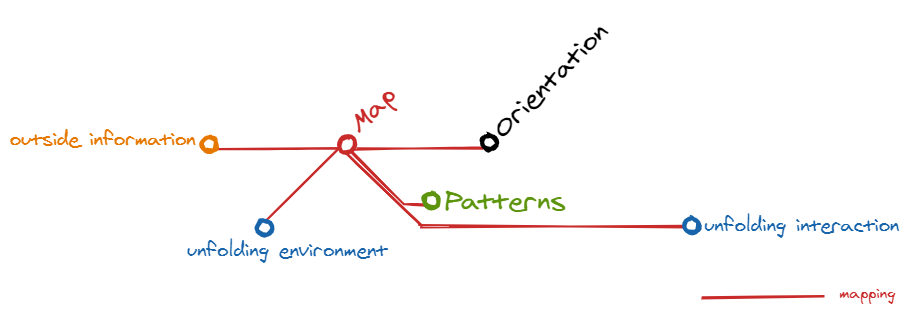

# MODA: from here to there in an agile world

[Boyd](https://www.airuniversity.af.edu/Portals/10/AUPress/Books/B_0151_Boyd_Discourse_Winning_Losing.PDF) referred to the OODA loop as “the big squeeze,” the ultimate compression of his ideas, the composite of how we think and learn.

The letters OODA stand for:
- **O**bserve: This is the part in which you use your eyes and ears to observe, to scan the environment 
- **O**rient: Then you try to understand (evaluate) your situation in relation to what you scanned. And what routes you can take to reach your (next) control point. 
- **D**ecide: Based on your orientation you choose what you think is the best possible next step that you wlll take 
- **A**ct: And then you take that next step…

### The original OODA Loop diagram

## The MODA map

I decided to make my own version of the OODA loop to better understand the decision-making and learning processes when using maps as primary source for the communication within change projects. I must note that I work (for twenty years now) as an IT/infrastruction/Solution Architect. For the people who know the Cynefin framework, for my work I live almost only in the Obvious and Complicated areas.

My version of the OODA loop has become the MODA map:

I've changed the following things in my MODA map compared to the original OODA loop:

* I've replaced Observe with Map. To be able to map you must be a good observer and sketcher. 
* I made it look like a subway diagram by removing the feedback and implicit guidance arrows. Like in the London Underground you can start where you want and go from every point to every other point. And you can skip intermediate points if you want. So it's not longer a loop but a undirected graph.
* I've added a feature called Patterns. This is a kind of library which can be internal in the heads of people or external, e.g. a folder where sketched maps are stored. This concept is borrowed from the OODA loop example in <a href="http://weblog.tetradian.com/2020/02/09/on-change-mapping-books-and-more/">Tom Graves his Change-mapping book</a>.
* I've added a feature called Patterns. This is a kind of library which can be internal in the heads of people or external, e.g. a folder where sketched maps are stored. This concept is borrowed from the OODA loop example in [Tom Graves his Change-mapping book](http://weblog.tetradian.com/2020/02/09/on-change-mapping-books-and-more/).

The MODE map has 5 different colored lines which will be described in the following paragraphs. For the descriptions I will use this very common starting question I often get:

> I need to get file to THERE, can you help?

#### Directing

Directing is the black main line:

#### Mapping

Mapping is the red line:

#### Learning

Learning is the green line:

#### Changing

Changing is the blue line:

#### Surprising

Surprising is the orange line:

---

## Contact
You can contact me on [Twitter](https://twitter.com/mapbakery)
