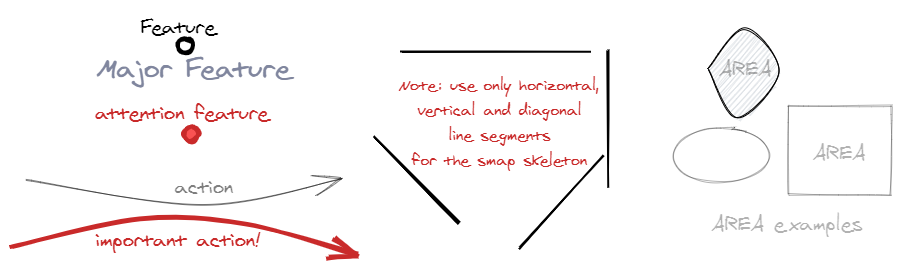

# Whenever somebody asks me for directions, I sketch a simple map...

>
>
>*Long  Creek Map sketched by Jeff Woodbury to show a photographer where to easily find polluted water for a shot.*  
>*(source: http://handmaps.org/curated9.html)*
---

## Mental mapping

Cognitive science and research work in other related areas has shown we develop ‘place cells’ in the brain corresponding to points in the physical or conceptual environment and gradually build them up into a mental map of points, paths and, eventually, areas. The mental map we build revolves around the relationship between memorable locations and routes insofar as they are relevant to our needs.

The way our brains mentally map areas means that when we encounter a new area, we start with specific arrival and destination points. From there, we find out paths between these points. We build up knowledge of the area surrounding the points and paths and, gradually, areas of areas (”areas all the way down”). Step by step, we build up our knowledge and increase our mental maps until we have as much information as we need.

The stronger a mental map we have, the more confident we are about planning a way to reach our destination, and the more confident we are to explore new areas. 

## The universal mapping language

Maps are an efficient, straightforward way of communicating a wealth of information. They provide a rich experience, quickly answering questions relevant to the map user, for example:

-	Where am I now?
-	Which direction do I need to go?
-	How difficult will it be to get there?

Just as our brain uses just three basic elements points, paths and areas to map the structure of the world, so can we use the same three elements to make maps which can be shared with others. And on these maps we can use arrows to indicate action, notes or directions.
So these are all elements you’ll need to know to make simple maps:

The advantages of using just those universal mapping elements is that:

-	Maps are easy to read.
-	Maps are easy to explain, there is no discussion about the meaning of the visual elements itself.
-	It’s easier make and improve maps together. People are also more inclined to give feedback thanks to the simplicity of the used visual elements.
-	When you tell a story it is easy to refer to parts of the map. 
-	**These kind of maps support and enforce our natural mental mapping process!**

## Living maps

For map users it is important that the maps follow the principle of ‘progressive disclosure’ – just enough information and not too much. So it is important that maps can be sketched quickly on the fly, e.g. on paper or on a (digital) whiteboard, for a dedicated purpose. Form follows function, so the looks are less important than the content and the consistent use of the four mapping elements (points, paths, areas and arrows). 

When a journey based on a sketched map has started, the map must be updated immediately if needed, e.g. when circumstances are changing. And everything is changing very fast these days:

Especially when makers, thinkers and decision -makers must work together it is important to have a set of common maps which are made via collaboration on a (digital) whiteboard. That gives everybody the opportunity to fill the holes in their own mental maps by aligning them with the whiteboard maps. It makes it also easy to discover the unknows, the things which need more exploration. 

The best thing is just to start mapping with just points, paths, areas and arrows. For inspiration you can look at some of the examples below.

## Examples

All examples, with the exception of the "a Trace in the Sand" journal subway map, are made with [Excalidraw](https://excalidraw.com/). The Excalidraw sources of the examples can be found in the [excalidraw folder](https://github.com/mapbakery/mapbakery.github.io/tree/master/excalidraw) in this repository.

### Mapping principles

I'm a great fan of Harry Beck, the designer of the modern London Underground map. He used these principles:

### A summary

In 2016 I made a subway map of the interesting articles and storylines of the  "a Trace in the Sand" journal by the [award-winning](https://resources.sei.cmu.edu/news-events/events/northrop-award/recipients.cfm) Architecture Consultant [Ruth Malan](http://www.ruthmalan.com/). When you click on this map you get a full-screen version on which you can click the station names to go to related journal article. This shows that maps are also useful to show the way through a huge amount of information. It's the mapmaker who decides which articles will get a station on the map so the map is subjective, like all maps. But you can use the map as a starting point to explore the journal beyond what's on the map.

### Interaction map

I used this small map to explain the resposibilities of the technical team. This was just the part of a bigger map (and project) they needed to give them enough context to start their activities:

### Problem solving

I made a map for people from 2 different companies working on a connectivity problem. One line was not working. The "novelty" is that I used numbers inside the stations  which makes it easier to discuss certain points in the connections: 

(note: the real names which I used in the map are removed)

### Learning (the OODA loop)

Often it helps to sketsch your own map when you are trying to understand somebody else his ([OODA](https://en.wikipedia.org/wiki/OODA_loop#/media/File:OODA.Boyd.svg)) diagram:

The nice thing of sketching your own version is that you get a whole lot ideas which you can map also very fast. And it's easy to get feedback on your ideas by showing them on Twitter. Like I did with the following iterations, I improved with the hel from [Ruth Malan](https://twitter.com/ruthmalan), [Tom Graves](https://twitter.com/tetradian) and [Oliver Baier](https://twitter.com/OliverBaier):

Which ultimately led to this subway map:

And sometimes it is also refreshing to sketch something from another perspective or direction, e.g.:

.png)

## References

My way of working and the text on this page are based upon ideas and texts from [Legible London: The Yellow Book A prototype wayfinding system for London](http://content.tfl.gov.uk/ll-yellow-book.pdf) and Barbara Tversky's [Mind in Motion: How Action Shapes Thought](https://www.skeptic.com/science-salon/mind-in-motion-how-action-shapes-thought/) book.

## Contact
You can contact me on [Twitter](https://twitter.com/mapbakery)
