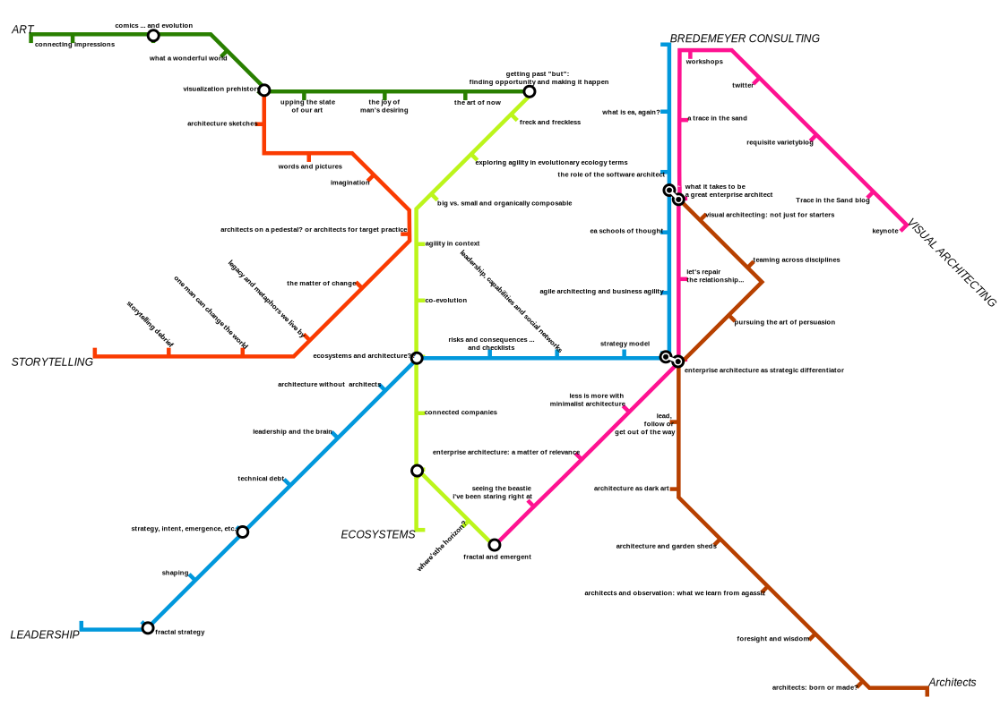

# Whenever somebody asks me for directions, I sketch a simple map...

---

## Mental mapping

Cognitive science and research work in other related areas has shown we develop ‘place cells’ in the brain corresponding to points in the physical or conceptual environment and gradually build them up into a mental map of places, routes and, eventually, areas. 
The mental map we build revolves around the relationship between memorable locations and routes insofar as they are relevant to our needs. 

The way our brains mentally map areas means that when we encounter a new area, we start with specific arrival and destination points. 
From there, we find out routes between these points. We build up knowledge of the area surrounding the nodes and, gradually, clusters of areas (”areas all the way down”). Step by step, we build up our knowledge and increase our mental maps until we have as much information as we need.

## Example

In 2016 I made a subway map of the interesting articles and storylines of the  "a Trace in the Sand" jornal by the [award-winning](https://resources.sei.cmu.edu/news-events/events/northrop-award/recipients.cfm) Architecture Consultant [Ruth Malan](http://www.ruthmalan.com/). When you click on this map you get a full-screen version on which you can click the station names to go to related journal article. This shows that maps are also useful to show the way in a pile of information.

## References

My way of working and the text on this page are based upon ideas and texts from [Legible London: The Yellow Book A prototype wayfinding system for London](http://content.tfl.gov.uk/ll-yellow-book.pdf) and Barbara Tversky's [Mind in Motion: How Action Shapes Thought](https://www.skeptic.com/science-salon/mind-in-motion-how-action-shapes-thought/) book.

## Contact
You can contact me on [Twitter](https://twitter.com/mapbakery)
